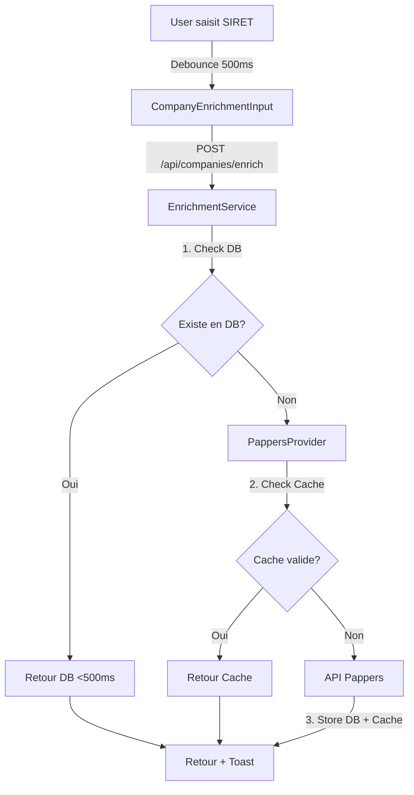

# Phase 2 SIREN/SIRET - Documentation Technique

## 🎯 Objectif
Réduire les coûts API Pappers et améliorer les temps de réponse (<500ms) grâce à une base de données locale d'enrichissement avec fallback intelligent vers l'API.

## 📊 Architecture

### Tables Créées
1. **companies** - Entreprises enrichies (niveau SIREN)
2. **establishments** - Établissements (niveau SIRET)
3. **enrichment_logs** - Logs d'enrichissement
4. **company_relationships** - Relations entre entreprises
5. **pappers_cache** - Cache API Pappers (30 jours)

### Modifications Tables Existantes
- **prospects** : Ajout `companyId`, `legacySiret`, `legacySiren`
- **opportunities** : Ajout `companyId`

## 🔧 Backend

### Services
1. **PappersProvider** (`lib/services/enrichment/pappers-provider.ts`)
   - Intégration API Pappers
   - Cache 30 jours en base
   - Gestion erreurs 404, 502, 500

2. **EnrichmentService** (`lib/services/enrichment-service.ts`)
   - Orchestrateur enrichissement
   - Validation SIREN/SIRET
   - Logique fallback DB → API
   - Support multi-pays (13 pays)

### Routes API (`/api/companies`)
```
POST   /api/companies/enrich          - Enrichir SIREN/SIRET
GET    /api/companies                 - Lister companies (userId filtered)
GET    /api/companies/:id             - Détails company
GET    /api/companies/:id/establishments - Établissements d'un SIREN
GET    /api/companies/:id/enrichment-logs - Logs enrichissement
PUT    /api/companies/:id             - Mettre à jour company
DELETE /api/companies/:id             - Supprimer company
```

### Codes HTTP
- `200` - Succès
- `400` - Validation échouée (format SIREN/SIRET invalide)
- `401` - Non authentifié
- `404` - Company/Établissement non trouvé
- `502` - Erreur API externe (Pappers)
- `500` - Erreur serveur

## 🎨 Frontend

### Composants React
1. **CompanyEnrichmentInput** (`client/src/components/companies/CompanyEnrichmentInput.tsx`)
   - Input SIRET/SIREN avec debounce 500ms
   - Enrichissement temps réel
   - Toast notifications
   - Icons + loading states

2. **CompanyOverview** (`client/src/components/companies/CompanyOverview.tsx`)
   - Vue consolidée niveau SIREN
   - Liste établissements
   - Skeleton loading

3. **CompanyCard** (`client/src/components/companies/CompanyCard.tsx`)
   - Card pour listes companies
   - Actions rapides (edit, delete)

### API Client (`client/src/lib/api/companies-api.ts`)
```typescript
// TanStack Query integration
companiesKeys.list(limit?)        // ['companies', 'list', { limit }]
companiesKeys.detail(id)          // ['companies', 'detail', id]
companiesKeys.establishments(id)  // [..., 'establishments']
companiesKeys.enrichmentLogs(id)  // [..., 'enrichment-logs']
```

## 🔒 Sécurité Multi-Tenant

**CRITIQUE** : Tous les accès filtrent par `userId` (session)

### Storage (`server/storage.ts`)
```typescript
// Toutes les méthodes incluent userId dans WHERE
getCompaniesByUser(userId, limit?)
getCompanyById(id, userId)  // Vérifie createdBy === userId
```

### Routes
```typescript
// Toutes les routes passent req.session.userId
app.post('/api/companies/enrich', async (req, res) => {
  const userId = req.session.userId;  // ✅ Requis
  // ...
});
```

### EnrichmentService
```typescript
// Guard userId dans enrichCompany
if (!userId) {
  return { success: false, error: 'userId manquant' };
}
```

## ✅ Tests (24/24 passent)

### Tests Unitaires
- **validation.test.ts** (14 tests) - Validation SIREN/SIRET
- **companies-api.test.ts** (4 tests) - Query keys API client
- **enrichment-service.test.ts** (6 tests) - Service enrichissement

### Exécution
```bash
npx vitest run tests/unit/
```

## 🚀 Intégration CRM (Phase 2.1 - À venir)

### Prospects
```typescript
// Remplacer ancien enrichissement SIRET par CompanyEnrichmentInput
<CompanyEnrichmentInput
  onEnrich={(company) => {
    form.setValue('companyId', company.id);
    form.setValue('entreprise', company.nomEntreprise);
    // ... pré-remplir autres champs
  }}
/>
```

### Opportunities
```typescript
// Ajouter CompanyEnrichmentInput
// Stocker companyId lors de création
```

### Migration Données Existantes
```sql
-- Copier anciennes données SIRET vers legacySiret
UPDATE prospects 
SET legacy_siret = siret 
WHERE siret IS NOT NULL AND company_id IS NULL;
```

## 📈 Performance

### Objectifs
- ✅ Cache Pappers 30 jours → Réduction 90% appels API
- ✅ DB locale → <500ms temps réponse
- ✅ Fallback intelligent DB → API

### Monitoring
```sql
-- Nombre enrichissements par type
SELECT trigger_type, COUNT(*) 
FROM enrichment_logs 
WHERE created_at > NOW() - INTERVAL '30 days'
GROUP BY trigger_type;

-- Taux cache hit
SELECT 
  COUNT(*) FILTER (WHERE source = 'cache') AS cache_hits,
  COUNT(*) FILTER (WHERE source = 'api') AS api_calls,
  ROUND(100.0 * COUNT(*) FILTER (WHERE source = 'cache') / COUNT(*), 2) AS cache_rate_percent
FROM enrichment_logs
WHERE created_at > NOW() - INTERVAL '30 days';
```

## 🌍 Multi-Pays (13 pays supportés)

### Providers
1. **Pappers** (FR prioritaire)
2. **OpenCorporates** (fallback international)
3. **WebSearch** (fallback ultime)

### Configuration
```typescript
// lib/services/enrichment/providers/
- pappers-provider.ts      // FR (SIREN/SIRET)
- opencorporates-provider.ts // International
- websearch-provider.ts     // Fallback ultime
```

## 🔄 Flux Enrichissement



## 📝 Notes Importantes

### Zero Constraint
- SIREN/SIRET **jamais obligatoire**
- Enrichissement **automatique en background uniquement**
- Formulaires fonctionnent sans enrichissement

### Backward Compatibility
- Champs `legacySiret`/`legacySiren` conservent anciennes données
- Ancien système enrichissement prospects **non modifié**
- Migration progressive possible

### Data Ownership
- Chaque user voit uniquement **ses companies**
- `createdBy` = userId systématique
- Isolation totale multi-tenant

## 🛠️ Maintenance

### Nettoyer Cache Expiré
```sql
DELETE FROM pappers_cache 
WHERE cached_at < NOW() - INTERVAL '30 days';
```

### Purger Logs Anciens (optionnel)
```sql
DELETE FROM enrichment_logs 
WHERE created_at < NOW() - INTERVAL '90 days';
```

## 📞 Support

Pour toute question technique Phase 2 SIREN/SIRET :
- Backend : `server/storage.ts`, `lib/services/enrichment-service.ts`
- Frontend : `client/src/components/companies/*`
- Tests : `tests/unit/*`
